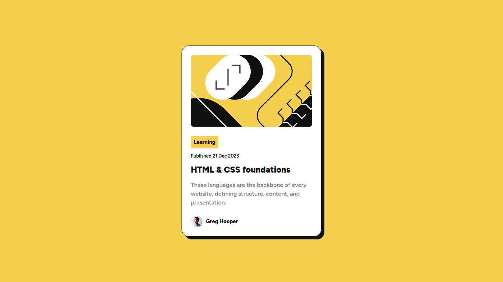

# Frontend Mentor - Blog preview card solution

This is a solution to the [Blog preview card challenge on Frontend Mentor](https://www.frontendmentor.io/challenges/blog-preview-card-ckPaj01IcS).

## Overview

### The challenge

Users should be able to:

-   Solution URL: [My solution page](https://www.frontendmentor.io/solutions/blog-preview-card-html-css-EMvehCKaRL)
-   See hover and focus states for all interactive elements on the page

### Screenshot

### Links

-   Live Site URL: [https://iambraga.github.io/blog-preview-card/](https://iambraga.github.io/blog-preview-card/)

## My process

### Built with

-   Semantic HTML5 markup
-   CSS properties
-   Flexbox

## Author

-   Website - [Eduardo Braga](https://github.com/iambraga)
-   Frontend Mentor - [@iambraga](https://www.frontendmentor.io/profile/iambraga)
